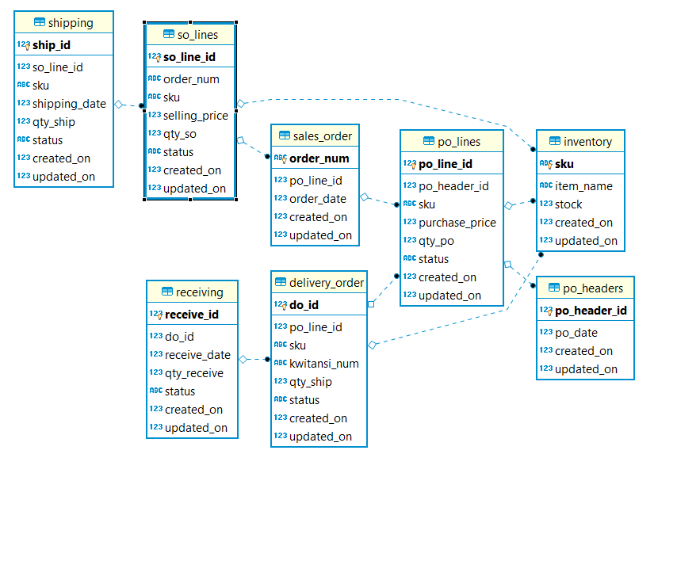

# Technical Assesment Inventory

---


---

## Requirement

- [Go 1.12 or higher](https://golang.org/dl/)
- [docker](https://www.docker.com/)
- [docker-compose](https://docs.docker.com/compose/)

## Overview and Assumption

Class Diagram



Technical assesment menggunakan gRPC (protobuff) karena asumsinya data yang ditransfer banyak, jika menggunakan HTTP 1 , akan lama di proses endcoding JSON.

Repo ini terdiri dari 2 service : 
- grpc-inventory : untuk get data from API dan interaksi ke database sqlite3.
- grpc-inventory-client : untuk generate csv file dan consume API dari grpc-inventory.

## How to trial 

- clone
```bash
git clone https://github.com/iqbaldp78/technical-assesment-inventory.git
```
- start docker

```shell
cd technical-assesment-inventory

docker-compose -f "docker-compose.yaml" up -d --build
```

## generate csv using docker
1. open browser 
2. copy paste endpoint
    - request endpoint catatan jumlah barang
```localhost:1234/web/onhandqty```

    - request endpoint catatan barang masuk ```localhost:1234/web/inboundgoods```

    - request endpoint catatan barang keluar ```localhost:1234/web/outboundsgoods```

    - request endpoint laporan nilai barang ```localhost:1234/web/reportvalue```

    - request endpoint laporan penjualan, endpoint ini menggunakan param query required
```localhost:1234/web/reportsales?date_from=2019-08-09&date_to=2019-08-11```
